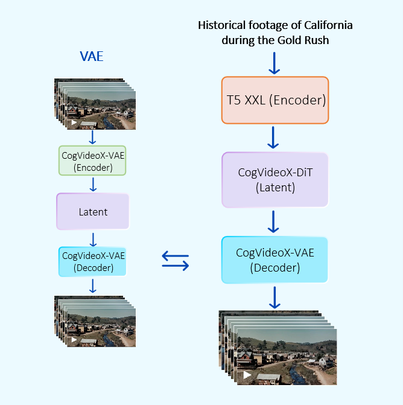

<div align="center">
  <picture>
    <source media="(prefers-color-scheme: dark)" srcset="assets/KANDINSKY_LOGO_1_WHITE.png">
    <source media="(prefers-color-scheme: light)" srcset="assets/KANDINSKY_LOGO_1_BLACK.png">
    
  </picture>
</div>

<div align="center">
  <a>Kandinsky 4.0 Post</a> | <a href=https://ai-forever.github.io/Kandinsky-4/K40/>Project Page</a> | <a href=https://huggingface.co/spaces/ai-forever/kandinsky-4-t2v-flash>Generate</a> | <a>Technical Report</a> | <a href=https://github.com/ai-forever/Kandinsky-4>GitHub</a> | <a href=https://huggingface.co/ai-forever/kandinsky-4-t2v-flash> Kandinsky 4.0 T2V Flash HuggingFace</a> | <a href=https://huggingface.co/ai-forever/kandinsky-4-v2a> Kandinsky 4.0 V2A HuggingFace</a>
</div>

<h1>Kandinsky 4.0: A family of diffusion models for Video generation.</h1>

In this repository, we provide a family of diffusion models for to generate a video using a textual prompt or an image (<em>Coming Soon</em>), flash model for a faster generation and a video to audio generation model.

## Content
<ul>
  <li><a href="#kandinsky-40-t2v">Kandinsky 4.0 T2V</a>: A text-to-video model - <em>Coming Soon</em></li>
  <li><a href="#kandinsky-40-t2v-flash">Kandinsky 4.0 T2V Flash</a>: A distilled version of Kandinsky 4.0 T2V 480p.</li>
  <li><a href="#kandinsky-40-i2v-image-to-video">Kandinsky 4.0 I2V</a>: An image-to-video - <em>Coming Soon</em> </li>
  <li><a href="#kandinsky-40-v2a">Kandinsky 4.0 V2A</a>: A video-to-audio model.</li>
</ul>


## Kandinsky 4.0 T2V

<em>Coming Soon</em> 🤗

### Examples:

<table border="0" style="width: 200; text-align: left; margin-top: 20px;">
  <tr>
      <td>
          <video src="https://github.com/user-attachments/assets/b324ee89-3deb-49e7-a506-92f67cd7dc54" width=200 controls autoplay loop></video>
      </td>
      <td>
          <video src="https://github.com/user-attachments/assets/fc7eb771-dd5e-4a5c-815a-6657f44b8e22" width=200 controls autoplay loop></video>
      </td>
      <td>
          <video src="https://github.com/user-attachments/assets/300af939-7516-4521-8eeb-6a660b70fb85" width=200 controls autoplay loop></video>
      </td>
      <td>
          <video src="https://github.com/user-attachments/assets/13a64f44-8d81-4760-8a69-dcd483ee62f2" width=200 controls autoplay loop></video>
      </td>
      <td>
          <video src="https://github.com/user-attachments/assets/fe99f74d-7ea9-41e1-9bb4-45ab258eb254" width=200 controls autoplay loop></video>
      </td>
  </tr>

</table>

<table border="0" style="width: 200; text-align: left; margin-top: 20px;">
  <tr>
      <td>
          <video src="https://github.com/user-attachments/assets/9bc737bc-9a58-46a1-b4d0-95df0a34ff88" width=200 controls autoplay loop></video>
      </td>
      <td>
          <video src="https://github.com/user-attachments/assets/c80362fd-e173-44c2-a774-6f36810be442" width=200 controls autoplay loop></video>
      </td>
  </tr>
  <tr>
      <td>
          <video src="https://github.com/user-attachments/assets/98012d67-5aa3-492a-82d9-9cb72f3c3cf8" width=200 controls autoplay loop></video>
      </td>
      <td>
          <video src="https://github.com/user-attachments/assets/c1e11759-3e15-415d-b9e8-4995b44e9194" width=200 controls autoplay loop></video>
      </td>
  </tr>

</table>

<table border="0" style="width: 200; text-align: left; margin-top: 20px;">
  <tr>
      <td>
          <video src="https://github.com/user-attachments/assets/49bfdab3-d978-4290-8b67-8dfbf32e590e" width=200 controls autoplay loop></video>
      </td>
      <td>
          <video src="https://github.com/user-attachments/assets/d038e86c-0346-4f55-a19e-27e861be09d8" width=200 controls autoplay loop></video>
      </td>
      <td>
          <video src="https://github.com/user-attachments/assets/ae06bd3f-c83f-4ec8-bf46-bf5cb1542db0" width=200 controls autoplay loop></video>
      </td>
      <td>
          <video src="https://github.com/user-attachments/assets/f42b1635-55c7-4b0d-85b7-ed674e5c2e50" width=200 controls autoplay loop></video>
      </td>
  </tr>

</table>

## Kandinsky 4.0 T2V Flash

Kandinsky 4.0 is a text-to-video generation model leveraging latent diffusion to produce videos in both 480p and HD resolutions. We also introduce Kandinsky 4 Flash, a distilled version of the model capable of generating 12-second 480p videos in just 11 seconds using a single NVIDIA H100 GPU. The pipeline integrates a 3D causal [CogVideoX](https://arxiv.org/pdf/2408.06072) VAE, the [T5-V1.1-XXL](https://huggingface.co/google/t5-v1_1-xxl) text embedder, and our custom-trained MMDiT-like transformer model. Kandinsky 4.0 Flash was trained using the Latent Adversarial Diffusion Distillation (LADD) approach, proposed for distilling image generation models and first described in the [article](https://arxiv.org/pdf/2403.12015) from Stability AI.

The following scheme describes the overall generation pipeline:
<div align="center">
  
</div>

### Inference

```python
import torch
from IPython.display import Video
from kandinsky import get_T2V_pipeline

device_map = {
    "dit": torch.device('cuda:0'), 
    "vae": torch.device('cuda:0'), 
    "text_embedder": torch.device('cuda:0')
}

pipe = get_T2V_pipeline(device_map)

images = pipe(
    seed=42,
    time_length=12,
    width = 672,
    height = 384,
    save_path="./test.mp4",
    text="Several giant wooly mammoths approach treading through a snowy meadow, their long wooly fur lightly blows in the wind as they walk, snow covered trees and dramatic snow capped mountains in the distance",
)

Video("./test.mp4")
```

Please, refer to [examples.ipynb](examples.ipynb) notebook for more usage details.

### Distributed Inference

For a faster inference, we also provide the capability to perform inference in a distributed way
```
NUMBER_OF_NODES=1
NUMBER_OF_DEVICES_PER_NODE=8
python -m torch.distributed.launch --nnodes $NUMBER_OF_NODES --nproc-per-node $NUMBER_OF_DEVICES_PER_NODE run_inference_distil.py
```

## Kandinsky 4.0 I2V (image-to-video)

<em>Coming Soon</em> 🤗

### Examples:

<table border="0" style="width: 100; text-align: left; margin-top: 20px;">
  <tr>
      <td>
          
      </td>
      <td>
          <video src="https://github.com/user-attachments/assets/e17f4384-9f81-4a75-a3b8-fe2431c30fac" width=200 controls autoplay loop></video>
      </td>
  </tr>
  <table border="0" style="width: 100; text-align: left; margin-top: 20px;">
  <tr>
      <td>
          
      </td>
      <td>
          <video src="https://github.com/user-attachments/assets/2116ace3-3edf-434d-a425-b13309a35bb7" width=200 controls autoplay loop></video>
      </td>
  </tr>
  <table border="0" style="width: 100; text-align: left; margin-top: 20px;">
  <tr>
      <td>
          
      </td>
      <td>
          <video src="https://github.com/user-attachments/assets/dbfa54ac-225d-4d30-94c1-eb371a5c6031" width=200 controls autoplay loop></video>
      </td>
  </tr>

</table>

### Examples:

<table border="0" style="width: 200; text-align: left; margin-top: 20px;">
  <tr>
      <td>
          <video src="https://github.com/user-attachments/assets/c52f5734-79de-4d09-b738-0ad09ffda25f" width=200 controls autoplay loop></video>
      </td>
      <td>
          <video src="https://github.com/user-attachments/assets/a0218156-3bc2-4464-8c06-84aac8c75927" width=200 controls autoplay loop></video>
      </td>
      <td>
          <video src="https://github.com/user-attachments/assets/91c6ee64-84a7-45a4-9e08-7eceacb8518a" width=200 controls autoplay loop></video>
      </td>
  </tr>

</table>


## Kandinsky 4.0 V2A


Video to Audio pipeline consists of a visual encoder, a text encoder, UNet diffusion model to generate spectrogram and Griffin-lim algorithm to convert spectrogram into audio. 
Visual and text encoders share the same multimodal visual language decoder ([cogvlm2-video-llama3-chat](link)). 

Our UNet diffusion model is a finetune of the music generation model [riffusion](https://huggingface.co/riffusion/riffusion-model-v1). We made modifications in the architecture to condition on video frames and improve the synchronization between video and audio. Also, we replace the text encoder with the decoder of [cogvlm2-video-llama3-chat](link).


### Inference

```python
import torch
import torchvision

from kandinsky4_video2audio.video2audio_pipe import Video2AudioPipeline
from kandinsky4_video2audio.utils import load_video, create_video

device='cuda:0'

pipe = Video2AudioPipeline(
    "ai-forever/kandinsky-4-v2a",
    torch_dtype=torch.float16,
    device = device
)

video_path = 'assets/inputs/1.mp4'
video, _, fps = torchvision.io.read_video(video_path)

prompt="clean. clear. good quality."
negative_prompt = "hissing noise. drumming rythm. saying. poor quality."
video_input, video_complete, duration_sec = load_video(video, fps['video_fps'], num_frames=96, max_duration_sec=12)
    
out = pipe(
    video_input,
    prompt,
    negative_prompt=negative_prompt,
    duration_sec=duration_sec, 
)[0]

save_path = f'assets/outputs/1.mp4'
create_video(
    out, 
    video_complete, 
    display_video=True,
    save_path=save_path,
    device=device
)
```

### Examples:

<table border="0" style="width: 200; text-align: left; margin-top: 20px;">
  <tr>
      <td>
          <video src="https://github.com/user-attachments/assets/6bb5cb9c-00b4-4d7a-9616-a1debf456e02" width=200 controls autoplay loop playsinline></video>
      </td>
      <td>
          <video src="https://github.com/user-attachments/assets/1eb223af-c743-4948-9532-9e6e097b979a" width=200 controls autoplay loop playsinline></video>
      </td>
      <td>
          <video src="https://github.com/user-attachments/assets/cf22eeee-67aa-4b32-bea8-23d6954852a5" width=200 controls autoplay loop playsinline></video>
      </td>
  </tr>
</table>

# Authors

<B>Project Leader:</B> Denis Dimitrov. </br>
<B>Scientific Consultants:</B> Andrey Kuznetsov, Sergey Markov.</br>
<B>Training Pipeline & Model Pretrain & Model Distillation:</B> Vladimir Arkhipkin, Novitskiy Lev, Maria Kovaleva. </br>
<B>Model Architecture:</B> Vladimir Arkhipkin, Maria Kovaleva, Zein Shaheen, Arsen Kuzhamuratov, Nikolay Gerasimenko, Mikhail Zhirnov, Alexandr Gambashidze, Konstantin Sobolev.</br>
<B>Data Pipeline:</B> Ivan Kirillov, Andrei Shutkin, Kirill Chernishev, Julia Agafonova, Denis Parkhomenko.</br>
<B>Video-to-audio model:</B> Zein Shaheen, Arseniy Shakhmatov, Denis Parkhomenko.</br>
<B>Quality Assessment:</B> Nikolay Gerasimenko, Anna Averchenkova.</br>
<B>Other Contributors:</B> Viacheslav Vasilev, Andrei Filatov, Gregory Leleytner.</br>
