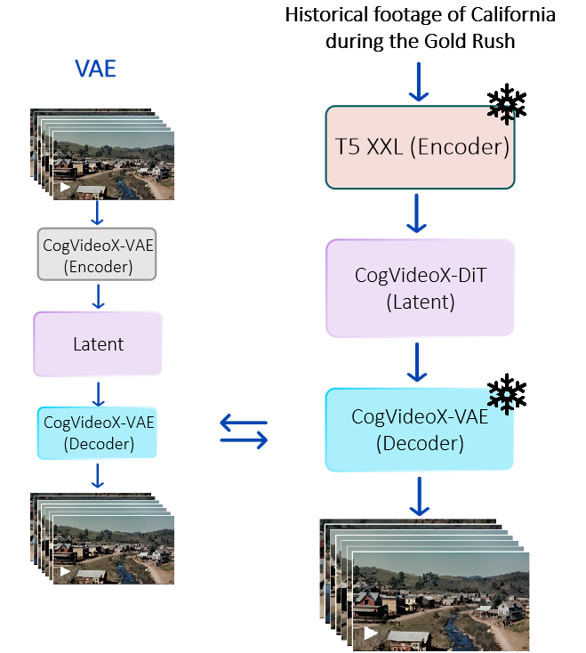

# Kandinsky-4: Text-to-Video diffusion model

This repository is the official implementation of Kandinsky-4 flash and Kandinsky-4 Audio.


<table border="0" style="width: 200; text-align: left; margin-top: 20px;">
  <tr>
      <td>
          <video src="https://github.com/user-attachments/assets/c52f5734-79de-4d09-b738-0ad09ffda25f" width=200 controls autoplay loop></video>
      </td>
      <td>
          <video src="https://github.com/user-attachments/assets/e3a8f092-469f-4f97-adac-0675a205a664" width=200 controls autoplay loop></video>
      </td>
      <td>
          <video src="https://github.com/user-attachments/assets/9131d737-e60e-4a49-ba22-498619071e82" width=200 controls autoplay loop></video>
      </td>
  </tr>

  <tr>
      <td>
          <video src="https://github.com/user-attachments/assets/9aa4850c-ed1f-4979-8476-d41ff2eb3835" width=200 controls autoplay loop></video>
      </td>
      <td>
          <video src="https://github.com/user-attachments/assets/8beb79ba-941f-4c3f-a937-53870911fe93" width=200 controls autoplay loop></video>
      </td>
      <td>
          <video src="https://github.com/user-attachments/assets/9fcc7668-2ecb-4621-8c58-472fdb6532f3" width=200 controls autoplay loop></video>
      </td>
  </tr>


  <tr>
      <td>
          <video src="https://github.com/user-attachments/assets/42fa8321-9b03-4864-84bc-c4181d17f49e" width=200 controls autoplay loop></video>
      </td>
      <td>
          <video src="https://github.com/user-attachments/assets/3a0f5674-60a6-4fc5-9d37-be6d57150d54" width=200 controls autoplay loop></video>
      </td>
      <td>
          <video src="https://github.com/user-attachments/assets/d3dabeeb-3b88-4d56-8700-1cb2a374fdb2" width=200 controls autoplay loop></video>
      </td>
  </tr>

  
</table>


[Kandinsky 4.0 Post]() | [Project Page]() | [Generate]() | [Telegram-bot]() | [Technical Report]() | [GitHub](https://github.com/ai-forever/Kandinsky-4) | [HuggingFace](https://huggingface.co/ai-forever/kandinsky4) |

## Description:

Kandinsky 4.0 is a text-to-video generation model based on latent diffusion for 480p and HD resolutions. Here we present distiled version of this model **Kandisnly 4 flash**, that can generate **12 second videos** in 480p resolution in **11 seconds** on a single NVIDIA H100 gpu. The pipeline consist of 3D causal [CogVideoX](https://arxiv.org/pdf/2408.06072) VAE, text embedder [T5-V1.1-XXL](https://huggingface.co/google/t5-v1_1-xxl) and our trained MMDiT-like transformer model.



A serious problem for all diffusion models, and especially video generation models, is the generation speed. To solve this problem, we used the Latent Adversarial Diffusion Distillation (LADD) approach, proposed for distilling image generation models and first described in the [article](https://arxiv.org/pdf/2403.12015) from Stability AI and tested by us when training the [Kandinsky 3.1](https://github.com/ai-forever/Kandinsky-3) image generation model. The distillation pipeline itself involves additional training of the diffusion model in the GAN pipeline, i.e. joint training of the diffusion generator with the discriminator.


## Architecture

For training Kandinsky 4 Flash we used the following architecture of diffusion transformer, based on MMDiT proposed in [Stable Diffusion 3](https://arxiv.org/pdf/2403.03206).

 

For training flash version we used the following architecture of discriminator. Discriminator head structure resembles half of an MMDiT block.

 


## How to use:

### 1. Text-to-Video
```python
import torch
from IPython.display import Video
from kandinsky import get_T2V_pipeline

device_map = {
    "dit": torch.device('cuda:0'), 
    "vae": torch.device('cuda:0'), 
    "text_embedder": torch.device('cuda:0')
}

pipe = get_T2V_pipeline(device_map)

images = pipe(
    seed=42,
    time_length=12,
    width = 672,
    height = 384,
    save_path="./test.mp4",
    text="Several giant wooly mammoths approach treading through a snowy meadow, their long wooly fur lightly blows in the wind as they walk, snow covered trees and dramatic snow capped mountains in the distance",
)

Video("./test.mp4")
```

Examples of usage and more detailed parameters description are in the [examples.ipynb](examples.ipynb) notebook.

Make sure that you have weights folder with weights of all models.

We also add distributed inference opportunity: [run_inference_distil.py](run_inference_distil.py)

To run this examples:
```
python -m torch.distributed.launch --nnodes n --nproc-per-node m run_inference_distil.py
```
where n is a number of nodes you have and m is a number of gpus on these nodes. The code was tested with n=1 and m=8, so this is preferable parameters.

In distributed setting the DiT models are parallelized using tensor parallel on all gpus, which enables a significant speedup.

To run this examples from terminal without tensor parallel:
```
python run_inference_distil.py
```

### 2. Video-to-Audio


Video to Audio pipeline consists of a visual encoder, a text encoder, UNet diffusion model to generate spectrogram and Griffin-lim algorithm to convert spectrogram into audio. 
Visual and text encoders share the same multimodal visual language decoder ([cogvlm2-video-llama3-chat](link)). 

Our UNet diffusion model is a finetune of the music generation model [riffusion](https://huggingface.co/riffusion/riffusion-model-v1). We made modifications in the architecture to condition on video frames and improve the synchronization between video and audio. Also, we replace the text encoder with the decoder of [cogvlm2-video-llama3-chat](link).


Inference code for Video-to-Audio:

```python
import torch
import torchvision

from kandinsky4_video2audio.video2audio_pipe import Video2AudioPipeline
from kandinsky4_video2audio.utils import load_video, create_video

device='cuda:0'

pipe = Video2AudioPipeline(
    "ai-forever/kandinsky4-Audio",
    torch_dtype=torch.float16,
    device = device
)

video_path = 'assets/inputs/1.mp4'
video, _, fps = torchvision.io.read_video(video_path)

prompt="clean. clear. good quality."
negative_prompt = "hissing noise. drumming rythm. saying. poor quality."
video_input, video_complete, duration_sec = load_video(video, fps['video_fps'], num_frames=96, max_duration_sec=12)
    
out = pipe(
    video_input,
    prompt,
    negative_prompt=negative_prompt,
    duration_sec=duration_sec, 
)[0]

save_path = f'assets/outputs/1.mp4'
create_video(
    out, 
    video_complete, 
    display_video=True,
    save_path=save_path,
    device=device
)
```


<table border="0" style="width: 200; text-align: left; margin-top: 20px;">
  <tr>
      <td>
          <video src="https://github.com/user-attachments/assets/6bb5cb9c-00b4-4d7a-9616-a1debf456e02" width=200 controls autoplay loop playsinline></video>
      </td>
      <td>
          <video src="https://github.com/user-attachments/assets/1eb223af-c743-4948-9532-9e6e097b979a" width=200 controls autoplay loop playsinline></video>
      </td>
      <td>
          <video src="https://github.com/user-attachments/assets/cf22eeee-67aa-4b32-bea8-23d6954852a5" width=200 controls autoplay loop playsinline></video>
      </td>
  </tr>
</table>


# Authors
+ Lev Novitkiy: [GitHub](https://github.com/leffff), [Blog](https://t.me/mlball_days)
+ Maria Kovaleva [GitHub](https://github.com/MarKovka20)
+ Vladimir Arkhipkin: [GitHub](https://github.com/oriBetelgeuse)
+ Ivan Kirillov: [GitHub](https://github.com/funnylittleman)
+ Zein Shaheen: [GitHub](https://github.com/zeinsh)
+ Arseniy Shakhmatov: [Github](https://github.com/cene555), [Blog](https://t.me/gradientdip)
+ Andrei Shutkin: [GitHub](https://github.com/maleficxp)
+ Kirill Chernishev: [GitHub](https://github.com/rtyasdf)
+ Denis Parkhomenko: [GitHub](https://github.com/nihao88)
+ Viacheslav Vasilev: [GitHub](https://github.com/vivasilev)
+ Andrei Filatov [GitHub](https://github.com/anvilarth)
+ Julia Agafonova [GitHub](https://github.com/Julia132)
+ Nikolay Gerasimenko [GitHub](https://github.com/Nikolay-Gerasimenko)
+ Andrey Kuznetsov: [GitHub](https://github.com/kuznetsoffandrey), [Blog](https://t.me/complete_ai)
+ Denis Dimitrov: [GitHub](https://github.com/denndimitrov), [Blog](https://t.me/dendi_math_ai)
