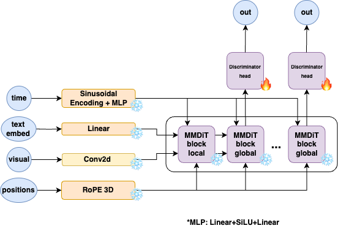

# Kandinsky-4 flash: Text-to-Video diffusion model


[Kandinsky 4.0 Post]() | [Project Page]() | [Generate]() | [Telegram-bot]() | [Technical Report]() |  [HuggingFace](https://huggingface.co/ai-forever/kandinsky4) |

## Description:

Kandinsky 4.0 is a text-to-video generation model based on latent diffusion for 480p and HD resolutions. Here we present distiled version of this model Kandisnly 4 flash, that can generate 12 second videos in 480p resolution in 11 seconds on single gpu. The pipeline consist of 3D causal [CogVideoX](https://arxiv.org/pdf/2408.06072) VAE, text embedder [T5-V1.1-XXL](https://huggingface.co/google/t5-v1_1-xxl) and our trained MMDiT-like transformer model.


A serious problem for all diffusion models, and especially video generation models, is the generation speed. To solve this problem, we used the Latent Adversarial Diffusion Distillation (LADD) approach, proposed for distilling image generation models and first described in the [article](https://arxiv.org/pdf/2403.12015) from Stability AI and tested by us when training the [Kandinsky 3.1](https://github.com/ai-forever/Kandinsky-3) image generation model. The distillation pipeline itself involves additional training of the diffusion model in the GAN pipeline, i.e. joint training of the diffusion generator with the discriminator.


## Architecture

For training Kandinsky 4 Flash we used the following architecture of diffusion transformer, based on MMDiT proposed in [Stable Diffusion 3](https://arxiv.org/pdf/2403.03206).

 

For training flash version we used the following architecture of discriminator. Discriminator head structure resembles half of an MMDiT block.

 


## How to use:
```python
import torch
from IPython.display import Video
from kandinsky import get_T2V_pipeline

device_map = {
    "dit": torch.device('cuda:0'), 
    "vae": torch.device('cuda:0'), 
    "text_embedder": torch.device('cuda:0')
}

pipe = get_T2V_pipeline(device_map)

images = pipe(
    seed=42,
    time_length=12,
    width = 672,
    height = 384,
    save_path="./test.mp4",
    text="Several giant wooly mammoths approach treading through a snowy meadow, their long wooly fur lightly blows in the wind as they walk, snow covered trees and dramatic snow capped mountains in the distance",
)

Video("./test.mp4")
```

Examples of usage and more detailed parameters description are in the [examples.ipynb](examples.ipynb) notebook.

Make sure that you have weights folder with weights of all models.

We also add distributed inference opportunity: [run_inference_distil.py](run_inference_distil.py)

To run this examples:
```
python -m torch.distributed.launch --nnodes n --nproc-per-node m run_inference_distil.py
```
where n is a number of nodes you have and m is a number of gpus on these nodes. The code was tested with n=1 and m=8, so this is preferable parameters.

In distributed setting the DiT models are parallelized using tensor parallel on all gpus, which enables a significant speedup.

To run this examples from terminal without tensor parallel:
```
python run_inference_distil.py
```

# Authors
+ Lev Novitkiy: [Github](https://github.com/leffff), [Blog](https://t.me/mlball_days)
+ Maria Kovaleva [Github](https://github.com/MarKovka20)
+ Vladimir Arkhipkin: [Github](https://github.com/oriBetelgeuse)
+ Denis Parkhomenko: [Github](https://github.com/nihao88)
+ Andrei Shutkin: [Github](https://github.com/maleficxp)
+ Ivan Kirillov: [Github](https://github.com/funnylittleman)
+ Zein Shaheen: [Github](https://github.com/zeinsh)
+ Viacheslav Vasilev: [Github](https://github.com/vivasilev)
+ Andrei Filatov [Github](https://github.com/anvilarth)
+ Julia Agafonova
+ Nikolay Gerasimenko [Github](https://github.com/Nikolay-Gerasimenko)
+ Andrey Kuznetsov: [Github](https://github.com/kuznetsoffandrey), [Blog](https://t.me/complete_ai)
+ Denis Dimitrov: [Github](https://github.com/denndimitrov), [Blog](https://t.me/dendi_math_ai)
